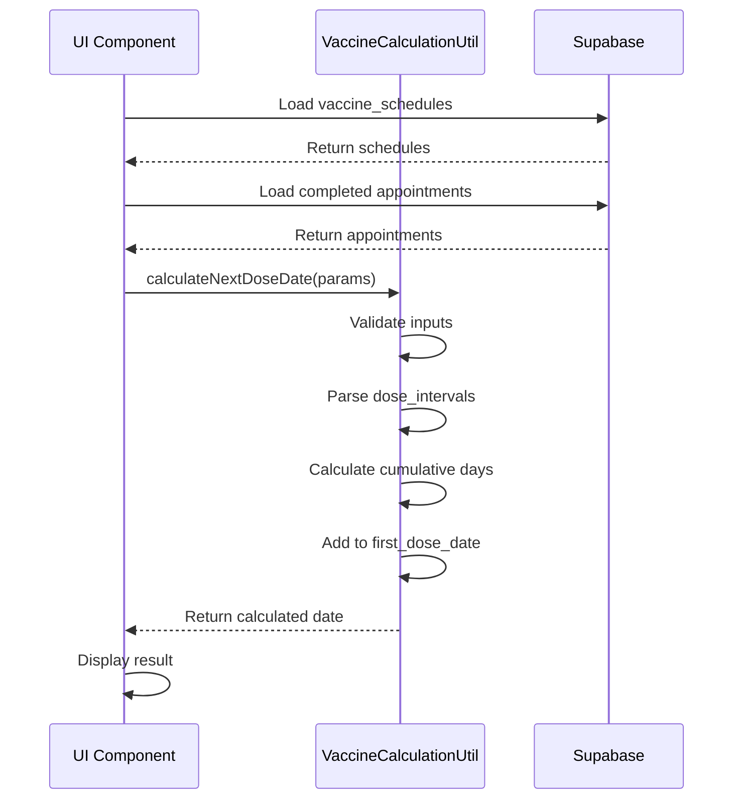

# Design Document

## Overview

การออกแบบนี้มุ่งเน้นการสร้างระบบคำนวณวันนัดวัคซีนที่เป็นมาตรฐานเดียวกันทั้งระบบ โดยยึดข้อมูลจากตาราง `vaccine_schedules` ใน Supabase เป็น Single Source of Truth การออกแบบจะแก้ไขปัญหาความไม่สอดคล้องกันในการคำนวณที่พบในคอมโพเนนต์ต่างๆ และสร้าง utility function ที่ใช้ร่วมกันได้

## Architecture

### High-Level Architecture

```
┌─────────────────────────────────────────────────────────────┐
│                    Presentation Layer                        │
│  ┌──────────────┐  ┌──────────────┐  ┌──────────────┐      │
│  │  Vaccine     │  │   Patient    │  │     Next     │      │
│  │  Schedule    │  │     Next     │  │ Appointments │      │
│  │  Calculator  │  │ Appointment  │  │              │      │
│  └──────┬───────┘  └──────┬───────┘  └──────┬───────┘      │
│         │                  │                  │              │
└─────────┼──────────────────┼──────────────────┼──────────────┘
          │                  │                  │
          └──────────────────┼──────────────────┘
                             │
                    ┌────────▼────────┐
                    │  Business Logic │
                    │  ┌────────────┐ │
                    │  │  Vaccine   │ │
                    │  │Calculation │ │
                    │  │  Utility   │ │
                    │  └────────────┘ │
                    └────────┬────────┘
                             │
                    ┌────────▼────────┐
                    │   Data Layer    │
                    │  ┌────────────┐ │
                    │  │  Supabase  │ │
                    │  │   Client   │ │
                    │  └────────────┘ │
                    └────────┬────────┘
                             │
                    ┌────────▼────────┐
                    │    Database     │
                    │ ┌────────────┐  │
                    │ │  vaccine_  │  │
                    │ │ schedules  │  │
                    │ └────────────┘  │
                    │ ┌────────────┐  │
                    │ │appointments│  │
                    │ └────────────┘  │
                    └─────────────────┘
```

### Component Interaction Flow



## Components and Interfaces

### 1. Vaccine Calculation Utility

**Location:** `src/lib/vaccineCalculationUtils.ts`

**Purpose:** Centralized utility for all vaccine appointment calculations

**Interface:**

```typescript
// Types
interface VaccineSchedule {
  id: string;
  vaccine_name: string;
  vaccine_type: string;
  total_doses: number;
  dose_intervals: number[] | any; // JSON array
  active: boolean;
}

interface CompletedDose {
  appointment_date: string;
  vaccine_type: string;
  status: 'completed';
}

interface CalculationParams {
  vaccineSchedule: VaccineSchedule;
  completedDoses: CompletedDose[];
  currentDoseNumber: number;
}

interface CalculationResult {
  nextDoseNumber: number;
  nextDoseDate: string | null;
  daysUntilNextDose: number | null;
  isComplete: boolean;
  calculationMethod: 'from_first_dose' | 'completed';
  firstDoseDate: string | null;
  cumulativeDays: number;
  intervalUsed: number;
  debugInfo: {
    vaccineType: string;
    totalDoses: number;
    intervals: number[];
    completedCount: number;
  };
}

// Main calculation function
export function calculateNextDoseDate(
  params: CalculationParams
): CalculationResult;

// Helper functions
export function parseDoseIntervals(
  intervals: number[] | any
): number[];

export function findFirstDoseDate(
  completedDoses: CompletedDose[]
): string | null;

export function calculateCumulativeDays(
  intervals: number[],
  currentDose: number
): number;

export function validateVaccineSchedule(
  schedule: VaccineSchedule
): boolean;

export function logCalculationSteps(
  params: CalculationParams,
  result: CalculationResult
): void;
```

### 2. Modified Components

#### VaccineScheduleCalculator

**Changes:**
- Replace inline calculation logic with `calculateNextDoseDate()`
- Use standardized logging format
- Display calculation debug info in UI

**Key Methods:**
```typescript
const loadPatientTracking = async () => {
  // ... existing code to load appointments ...
  
  for (const patient of patientVaccineMap.values()) {
    const schedule = vaccineSchedules?.find(vs => 
      vs.vaccine_type.toLowerCase() === patient.vaccine_type.toLowerCase()
    );
    
    // NEW: Use utility function
    const result = calculateNextDoseDate({
      vaccineSchedule: schedule,
      completedDoses: patient.completedDoses,
      currentDoseNumber: patient.doses_received
    });
    
    // Use result.nextDoseDate for tracking
  }
};
```

#### PatientNextAppointment

**Changes:**
- Replace calculation logic with utility function
- Standardize error handling
- Use consistent logging

**Key Methods:**
```typescript
const loadNextAppointments = async (userId: string) => {
  // ... existing code ...
  
  const nextAppointmentPromises = Array.from(vaccineMap.values()).map(async (vaccine) => {
    const schedule = vaccineSchedules?.find(vs => 
      vs.vaccine_type.toLowerCase() === vaccine.vaccine_type.toLowerCase()
    );
    
    // NEW: Use utility function
    const result = calculateNextDoseDate({
      vaccineSchedule: schedule,
      completedDoses: vaccine.completedDoses,
      currentDoseNumber: vaccine.doses_received
    });
    
    return {
      // ... other fields ...
      next_dose_due: result.nextDoseDate,
      calculation_info: result.debugInfo
    };
  });
};
```

#### NextAppointments

**Changes:**
- Use utility function for calculations
- Add calculation verification display
- Show comparison between calculated and scheduled dates

#### VaccineDoseCalculator

**Changes:**
- Replace manual calculation with utility
- Use standardized validation
- Display calculation breakdown

## Data Models

### Vaccine Schedule (from Supabase)

```typescript
{
  id: string;                    // UUID
  vaccine_name: string;          // "วัคซีนไข้หวัดใหญ่"
  vaccine_type: string;          // "influenza"
  total_doses: number;           // 2
  dose_intervals: number[];      // [30] or JSON "[30]"
  age_restrictions: {
    min_age?: number;
    max_age?: number;
  };
  contraindications: string[];
  indications: string[];
  side_effects: string[];
  efficacy_duration: number;     // days
  booster_required: boolean;
  booster_interval: number | null;
  active: boolean;
  created_at: string;
  updated_at: string;
}
```

### Appointment (from Supabase)

```typescript
{
  id: string;
  patient_id_number: string;
  patient_name: string;
  line_user_id: string | null;
  vaccine_type: string;
  vaccine_name: string | null;
  appointment_date: string;      // YYYY-MM-DD
  appointment_time: string | null;
  status: 'pending' | 'scheduled' | 'completed' | 'cancelled';
  location: string | null;
  notes: string | null;
  created_at: string;
  updated_at: string;
}
```

### Calculation Result (Internal)

```typescript
{
  nextDoseNumber: number;        // 2, 3, etc.
  nextDoseDate: string | null;   // "2024-12-15"
  daysUntilNextDose: number | null; // 30
  isComplete: boolean;           // false
  calculationMethod: string;     // "from_first_dose"
  firstDoseDate: string | null;  // "2024-11-15"
  cumulativeDays: number;        // 30
  intervalUsed: number;          // 30
  debugInfo: {
    vaccineType: string;         // "influenza"
    totalDoses: number;          // 2
    intervals: number[];         // [30]
    completedCount: number;      // 1
  }
}
```

## Error Handling

### Error Types and Responses

```typescript
enum CalculationErrorType {
  MISSING_VACCINE_SCHEDULE = 'MISSING_VACCINE_SCHEDULE',
  INVALID_DOSE_INTERVALS = 'INVALID_DOSE_INTERVALS',
  NO_COMPLETED_DOSES = 'NO_COMPLETED_DOSES',
  INVALID_FIRST_DOSE_DATE = 'INVALID_FIRST_DOSE_DATE',
  CALCULATION_ERROR = 'CALCULATION_ERROR'
}

interface CalculationError {
  type: CalculationErrorType;
  message: string;
  details?: any;
}

// Error handling in utility
export function calculateNextDoseDate(
  params: CalculationParams
): CalculationResult | CalculationError {
  try {
    // Validate vaccine schedule
    if (!params.vaccineSchedule) {
      return {
        type: CalculationErrorType.MISSING_VACCINE_SCHEDULE,
        message: 'ไม่พบข้อมูลวัคซีนในระบบ',
        details: { vaccineType: params.vaccineSchedule?.vaccine_type }
      };
    }
    
    // Validate completed doses
    if (!params.completedDoses || params.completedDoses.length === 0) {
      return {
        type: CalculationErrorType.NO_COMPLETED_DOSES,
        message: 'ไม่พบข้อมูลการฉีดวัคซีน',
        details: { currentDose: params.currentDoseNumber }
      };
    }
    
    // Parse intervals
    const intervals = parseDoseIntervals(params.vaccineSchedule.dose_intervals);
    if (!intervals || intervals.length === 0) {
      console.warn('⚠️ Invalid dose_intervals, using default 30 days');
      // Use default but continue
    }
    
    // ... calculation logic ...
    
  } catch (error) {
    console.error('❌ Calculation error:', error);
    return {
      type: CalculationErrorType.CALCULATION_ERROR,
      message: 'เกิดข้อผิดพลาดในการคำนวณ',
      details: { error: error.message }
    };
  }
}
```

### UI Error Display

```typescript
// In components
const result = calculateNextDoseDate(params);

if ('type' in result) {
  // It's an error
  toast({
    title: "ไม่สามารถคำนวณได้",
    description: result.message,
    variant: "destructive"
  });
  console.error('Calculation error:', result);
  return;
}

// It's a successful result
setCalculation(result);
```

## Testing Strategy

### Unit Tests

**File:** `src/lib/__tests__/vaccineCalculationUtils.test.ts`

```typescript
describe('vaccineCalculationUtils', () => {
  describe('calculateNextDoseDate', () => {
    it('should calculate next dose from first dose date', () => {
      const params = {
        vaccineSchedule: {
          id: '1',
          vaccine_type: 'influenza',
          total_doses: 2,
          dose_intervals: [30]
        },
        completedDoses: [
          { appointment_date: '2024-01-01', vaccine_type: 'influenza', status: 'completed' }
        ],
        currentDoseNumber: 1
      };
      
      const result = calculateNextDoseDate(params);
      
      expect(result.nextDoseNumber).toBe(2);
      expect(result.nextDoseDate).toBe('2024-01-31');
      expect(result.cumulativeDays).toBe(30);
    });
    
    it('should handle multiple doses with cumulative intervals', () => {
      const params = {
        vaccineSchedule: {
          id: '1',
          vaccine_type: 'hpv',
          total_doses: 3,
          dose_intervals: [60, 120] // dose 1->2: 60 days, dose 2->3: 120 days
        },
        completedDoses: [
          { appointment_date: '2024-01-01', vaccine_type: 'hpv', status: 'completed' },
          { appointment_date: '2024-03-02', vaccine_type: 'hpv', status: 'completed' }
        ],
        currentDoseNumber: 2
      };
      
      const result = calculateNextDoseDate(params);
      
      expect(result.nextDoseNumber).toBe(3);
      // Should be first_dose (2024-01-01) + 60 + 120 = 2024-05-01
      expect(result.nextDoseDate).toBe('2024-05-01');
      expect(result.cumulativeDays).toBe(180);
    });
    
    it('should return isComplete when all doses received', () => {
      const params = {
        vaccineSchedule: {
          id: '1',
          vaccine_type: 'influenza',
          total_doses: 2,
          dose_intervals: [30]
        },
        completedDoses: [
          { appointment_date: '2024-01-01', vaccine_type: 'influenza', status: 'completed' },
          { appointment_date: '2024-01-31', vaccine_type: 'influenza', status: 'completed' }
        ],
        currentDoseNumber: 2
      };
      
      const result = calculateNextDoseDate(params);
      
      expect(result.isComplete).toBe(true);
      expect(result.nextDoseDate).toBeNull();
    });
    
    it('should handle JSON string dose_intervals', () => {
      const params = {
        vaccineSchedule: {
          id: '1',
          vaccine_type: 'influenza',
          total_doses: 2,
          dose_intervals: '[30]' // JSON string
        },
        completedDoses: [
          { appointment_date: '2024-01-01', vaccine_type: 'influenza', status: 'completed' }
        ],
        currentDoseNumber: 1
      };
      
      const result = calculateNextDoseDate(params);
      
      expect(result.nextDoseDate).toBe('2024-01-31');
    });
    
    it('should return error for missing vaccine schedule', () => {
      const params = {
        vaccineSchedule: null,
        completedDoses: [],
        currentDoseNumber: 0
      };
      
      const result = calculateNextDoseDate(params);
      
      expect(result.type).toBe('MISSING_VACCINE_SCHEDULE');
      expect(result.message).toContain('ไม่พบข้อมูลวัคซีน');
    });
  });
  
  describe('parseDoseIntervals', () => {
    it('should parse array of numbers', () => {
      expect(parseDoseIntervals([30, 60])).toEqual([30, 60]);
    });
    
    it('should parse JSON string', () => {
      expect(parseDoseIntervals('[30, 60]')).toEqual([30, 60]);
    });
    
    it('should return empty array for invalid input', () => {
      expect(parseDoseIntervals(null)).toEqual([]);
      expect(parseDoseIntervals('invalid')).toEqual([]);
    });
  });
  
  describe('findFirstDoseDate', () => {
    it('should find earliest appointment date', () => {
      const doses = [
        { appointment_date: '2024-03-01', vaccine_type: 'flu', status: 'completed' },
        { appointment_date: '2024-01-01', vaccine_type: 'flu', status: 'completed' },
        { appointment_date: '2024-02-01', vaccine_type: 'flu', status: 'completed' }
      ];
      
      expect(findFirstDoseDate(doses)).toBe('2024-01-01');
    });
    
    it('should return null for empty array', () => {
      expect(findFirstDoseDate([])).toBeNull();
    });
  });
  
  describe('calculateCumulativeDays', () => {
    it('should sum intervals up to current dose', () => {
      expect(calculateCumulativeDays([30, 60, 90], 2)).toBe(90); // 30 + 60
      expect(calculateCumulativeDays([30, 60, 90], 3)).toBe(180); // 30 + 60 + 90
    });
    
    it('should return 0 for first dose', () => {
      expect(calculateCumulativeDays([30, 60], 0)).toBe(0);
    });
  });
});
```

### Integration Tests

**File:** `src/components/__tests__/VaccineCalculation.integration.test.tsx`

```typescript
describe('Vaccine Calculation Integration', () => {
  it('should calculate consistently across all components', async () => {
    // Setup mock data
    const mockSchedule = {
      id: '1',
      vaccine_type: 'influenza',
      vaccine_name: 'วัคซีนไข้หวัดใหญ่',
      total_doses: 2,
      dose_intervals: [30],
      active: true
    };
    
    const mockAppointments = [
      {
        id: '1',
        patient_id_number: 'P001',
        vaccine_type: 'influenza',
        appointment_date: '2024-01-01',
        status: 'completed'
      }
    ];
    
    // Test VaccineScheduleCalculator
    const result1 = calculateNextDoseDate({
      vaccineSchedule: mockSchedule,
      completedDoses: mockAppointments,
      currentDoseNumber: 1
    });
    
    // Test PatientNextAppointment
    const result2 = calculateNextDoseDate({
      vaccineSchedule: mockSchedule,
      completedDoses: mockAppointments,
      currentDoseNumber: 1
    });
    
    // Test NextAppointments
    const result3 = calculateNextDoseDate({
      vaccineSchedule: mockSchedule,
      completedDoses: mockAppointments,
      currentDoseNumber: 1
    });
    
    // All should return same date
    expect(result1.nextDoseDate).toBe('2024-01-31');
    expect(result2.nextDoseDate).toBe('2024-01-31');
    expect(result3.nextDoseDate).toBe('2024-01-31');
  });
});
```

### Manual Testing Checklist

- [ ] Load vaccine schedules from database
- [ ] Calculate next dose for single-dose vaccine
- [ ] Calculate next dose for multi-dose vaccine
- [ ] Verify calculation with irregular intervals
- [ ] Test with existing scheduled appointments
- [ ] Test completion status when all doses received
- [ ] Verify error handling for missing data
- [ ] Check logging output in console
- [ ] Test with different vaccine types
- [ ] Verify UI displays calculated dates correctly
- [ ] Test calculation performance with 100+ patients
- [ ] Verify database queries are optimized

## Implementation Plan

### Phase 1: Create Utility Function (Priority: High)
- Create `src/lib/vaccineCalculationUtils.ts`
- Implement core calculation logic
- Add validation and error handling
- Write unit tests
- Document all functions

### Phase 2: Update VaccineScheduleCalculator (Priority: High)
- Replace inline calculation with utility
- Update logging format
- Add debug info display
- Test thoroughly

### Phase 3: Update PatientNextAppointment (Priority: High)
- Replace calculation logic
- Standardize error handling
- Update UI to show calculation info
- Test with real user data

### Phase 4: Update NextAppointments (Priority: Medium)
- Integrate utility function
- Add calculation verification display
- Show comparison between calculated and scheduled
- Test with multiple patients

### Phase 5: Update VaccineDoseCalculator (Priority: Medium)
- Replace manual calculation
- Use standardized validation
- Display calculation breakdown
- Test edge cases

### Phase 6: Testing and Validation (Priority: High)
- Run all unit tests
- Perform integration testing
- Manual testing with production data
- Performance testing
- Bug fixes

### Phase 7: Documentation and Deployment (Priority: Medium)
- Update code documentation
- Create user guide
- Deploy to staging
- Monitor for issues
- Deploy to production

## Performance Considerations

### Optimization Strategies

1. **Caching Vaccine Schedules**
   ```typescript
   // Cache schedules for 5 minutes
   const scheduleCache = new Map<string, { data: VaccineSchedule, timestamp: number }>();
   
   async function getVaccineSchedule(vaccineType: string): Promise<VaccineSchedule> {
     const cached = scheduleCache.get(vaccineType);
     if (cached && Date.now() - cached.timestamp < 300000) {
       return cached.data;
     }
     
     const schedule = await fetchFromDatabase(vaccineType);
     scheduleCache.set(vaccineType, { data: schedule, timestamp: Date.now() });
     return schedule;
   }
   ```

2. **Batch Database Queries**
   ```typescript
   // Instead of querying one by one
   const schedules = await Promise.all(
     vaccineTypes.map(type => getVaccineSchedule(type))
   );
   ```

3. **Memoization**
   ```typescript
   const memoizedCalculation = useMemo(() => {
     return calculateNextDoseDate(params);
   }, [params.vaccineSchedule.id, params.currentDoseNumber]);
   ```

4. **Index Optimization**
   - Ensure indexes on `appointments.patient_id_number`
   - Index on `appointments.vaccine_type`
   - Index on `appointments.status`
   - Composite index on `(patient_id_number, vaccine_type, status)`

## Security Considerations

- Validate all input data before calculation
- Sanitize vaccine schedule data from database
- Log calculation errors without exposing sensitive data
- Ensure proper access control for vaccine schedule modifications
- Audit trail for calculation changes

## Monitoring and Logging

### Logging Format

```typescript
// Success log
console.log(`🎯 ${patientName}: คำนวณจาก vaccine_schedules`);
console.log(`   - วัคซีน: ${vaccineType}`);
console.log(`   - เข็มแรก: ${firstDoseDate}`);
console.log(`   - รวมระยะห่าง: ${cumulativeDays} วัน`);
console.log(`   - นัดเข็มที่ ${nextDoseNumber}: ${nextDoseDate}`);

// Error log
console.error(`❌ ไม่สามารถคำนวณได้: ${errorMessage}`);
console.error(`   - ผู้ป่วย: ${patientName}`);
console.error(`   - วัคซีน: ${vaccineType}`);
console.error(`   - สาเหตุ: ${errorDetails}`);
```

### Metrics to Track

- Calculation success rate
- Average calculation time
- Error frequency by type
- Cache hit rate
- Database query performance
