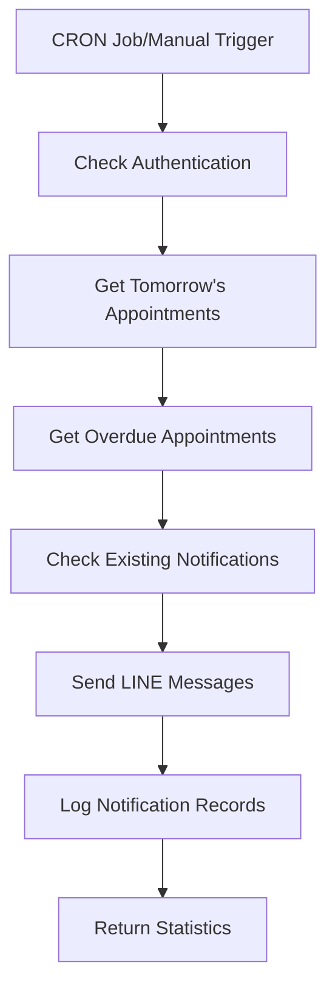
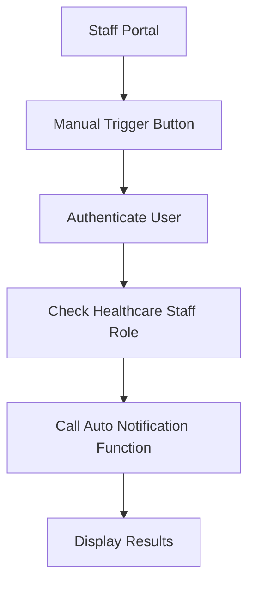

# รายงานการตรวจสอบระบบการแจ้งเตือนนัดคนไข้

## สรุประบบการแจ้งเตือน

ระบบการแจ้งเตือนนัดคนไข้มีการออกแบบที่ครบถ้วนและมีหลายส่วนประกอบที่ทำงานร่วมกัน

## 🔍 ส่วนประกอบหลักของระบบ

### 1. Database Tables
- **`appointment_notifications`** - เก็บประวัติการแจ้งเตือน
- **`notification_jobs`** - คิวงานแจ้งเตือน
- **`notification_schedules`** - ตารางการแจ้งเตือน
- **`appointments`** - ข้อมูลนัดหมาย

### 2. Supabase Functions
- **`auto-vaccine-notifications`** - ระบบแจ้งเตือนอัตโนมัติหลัก
- **`manual-notification-trigger`** - เรียกใช้ระบบแจ้งเตือนด้วยตนเอง
- **`notification-processor`** - ประมวลผลการแจ้งเตือน

### 3. UI Components
- **`AutoNotificationSystem`** - หน้าจัดการระบบแจ้งเตือน
- **`NotificationTestPanel`** - เครื่องมือทดสอบระบบ
- **`NotificationToast`** - UI แสดงการแจ้งเตือน

## 📱 ประเภทการแจ้งเตือน

### 1. Reminder Notifications (แจ้งเตือนล่วงหน้า)
```typescript
// ส่งแจ้งเตือน 1 วันก่อนวันนัด
const tomorrow = new Date()
tomorrow.setDate(tomorrow.getDate() + 1)
const tomorrowStr = tomorrow.toISOString().split('T')[0]
```

**ข้อความแจ้งเตือน:**
```
🔔 แจ้งเตือนการนัดหมายฉีดวัคซีน

สวัสดีคุณ [ชื่อผู้ป่วย]

📅 วันที่: [วันที่นัด]
⏰ เวลา: [เวลานัด]
💉 วัคซีน: [ประเภทวัคซีน]
🏥 สถานที่: โรงพยาบาลโฮม

กรุณามาตามเวลานัดหมาย
หากมีข้อสงสัยสามารถติดต่อโรงพยาบาลได้
```

### 2. Overdue Notifications (แจ้งเตือนเกินกำหนด)
```typescript
// ตรวจสอบนัดที่เกินกำหนดแล้ว
const today = new Date().toISOString().split('T')[0]
// appointments where appointment_date < today AND status = 'scheduled'
```

**ข้อความแจ้งเตือน:**
```
⚠️ การนัดหมายฉีดวัคซีนเกินกำหนด

คุณ [ชื่อผู้ป่วย]

📅 วันที่นัด: [วันที่นัด]
💉 วัคซีน: [ประเภทวัคซีน]
🏥 สถานที่: โรงพยาบาลโฮม

การนัดหมายของคุณเกินกำหนดแล้ว
กรุณาติดต่อโรงพยาบาลเพื่อนัดหมายใหม่
```

## 🔐 ระบบความปลอดภัย

### Authentication & Authorization
```typescript
// ตรวจสอบสิทธิ์ healthcare staff
const { data: hasStaffRole, error: roleError } = await supabase
  .rpc('is_healthcare_staff', { _user_id: user.id })

if (roleError || !hasStaffRole) {
  return new Response(
    JSON.stringify({ error: 'Access denied: Healthcare staff role required' }),
    { status: 403 }
  )
}
```

### CRON Secret Authentication
```typescript
// สำหรับ automated CRON jobs
const cronSecret = req.headers.get('x-cron-secret')
if (cronSecret === Deno.env.get('CRON_SECRET')) {
  console.log('Authenticated via CRON secret')
}
```

## 📊 การทำงานของระบบ

### 1. Auto Notification Flow


### 2. Manual Trigger Flow


## 🎯 UI Components Analysis

### AutoNotificationSystem Component

#### Features:
- ✅ Manual trigger button
- ✅ Real-time statistics display
- ✅ Notification history
- ✅ Status indicators
- ✅ Responsive design

#### Statistics Display:
```typescript
interface NotificationStats {
  appointmentsChecked: number;        // นัดพรุ่งนี้
  overdueAppointmentsChecked: number; // นัดเกินกำหนด
  notificationsSent: number;          // ส่งสำเร็จ
  errors: number;                     // ข้อผิดพลาด
}
```

#### UI Elements:
- 📊 **Statistics Cards**: แสดงผลการทำงาน
- 📋 **History List**: ประวัติการแจ้งเตือน
- 🔄 **Refresh Button**: โหลดข้อมูลใหม่
- ▶️ **Trigger Button**: เรียกใช้ระบบ

### NotificationTestPanel Component

#### Test Coverage:
1. **Database Connection** - ทดสอบการเชื่อมต่อ
2. **Notifications Table** - ตรวจสอบตาราง
3. **Tomorrow Appointments** - นัดพรุ่งนี้
4. **Overdue Appointments** - นัดเกินกำหนด
5. **Notification Function** - ฟังก์ชันแจ้งเตือน
6. **CRON Job Status** - สถานะ CRON
7. **Recent Notifications** - การแจ้งเตือนล่าสุด
8. **Notification Jobs Queue** - คิวงาน

#### Test Results Display:
```typescript
interface TestResult {
  test: string;
  status: 'success' | 'error' | 'warning';
  message: string;
  details?: any;
}
```

### NotificationToast Component

#### Toast Types:
- ✅ **Success**: สีเขียว, CheckCircle icon
- ❌ **Error**: สีแดง, AlertCircle icon
- ⚠️ **Warning**: สีเหลือง, AlertTriangle icon
- ℹ️ **Info**: สีน้ำเงิน, Info icon

#### Features:
- 🎨 Gradient backgrounds
- ⏱️ Auto-close with progress bar
- 🎯 Click to close
- 📱 Responsive positioning

## 🔧 การตั้งค่าและ Configuration

### Environment Variables
```bash
# Supabase
SUPABASE_URL=https://fljyjbrgfzervxofrilo.supabase.co
SUPABASE_SERVICE_ROLE_KEY=[service-role-key]
SUPABASE_ANON_KEY=[anon-key]

# LINE Bot
LINE_CHANNEL_ACCESS_TOKEN=[line-token]

# Security
CRON_SECRET=[cron-secret]
```

### Database Schema
```sql
-- appointment_notifications table
CREATE TABLE appointment_notifications (
  id UUID PRIMARY KEY DEFAULT gen_random_uuid(),
  appointment_id UUID REFERENCES appointments(id),
  notification_type TEXT NOT NULL, -- 'reminder', 'overdue'
  sent_to TEXT NOT NULL,
  line_user_id TEXT,
  message_content TEXT,
  status TEXT NOT NULL, -- 'sent', 'failed', 'pending'
  sent_at TIMESTAMP WITH TIME ZONE DEFAULT now(),
  created_at TIMESTAMP WITH TIME ZONE DEFAULT now()
);
```

## 📈 Performance & Monitoring

### Logging
```typescript
console.log('Auto notification system started')
console.log(`Found ${appointments.length} appointments for tomorrow`)
console.log(`Found ${overdueAppointments.length} overdue appointments`)
console.log(`LINE message sent successfully to ${appointment.patient_name}`)
```

### Error Handling
```typescript
try {
  // Send notification
} catch (error) {
  console.error(`Error processing appointment ${appointment.appointment_id}:`, error)
  errorsCount++
}
```

### Duplicate Prevention
```typescript
// Check if notification was already sent today
const existingNotificationResponse = await fetch(
  `${SUPABASE_URL}/rest/v1/appointment_notifications?appointment_id=eq.${appointment.id}&notification_type=eq.reminder&sent_at=gte.${today}T00:00:00`
)
```

## 🚀 การใช้งาน

### สำหรับ Staff
1. เข้าสู่ระบบ Staff Portal
2. ไปที่แท็บ "ตั้งค่า"
3. ใช้ "ระบบแจ้งเตือนอัตโนมัติ"
4. กดปุ่ม "เรียกใช้ระบบแจ้งเตือน"

### สำหรับ Testing
1. ใช้ "ทดสอบระบบแจ้งเตือนอัตโนมัติ"
2. กดปุ่ม "เริ่มทดสอบระบบ"
3. ตรวจสอบผลการทดสอบ

## ⚠️ ปัญหาที่อาจพบ

### 1. LINE Token Issues
```typescript
if (!LINE_CHANNEL_ACCESS_TOKEN) {
  console.log('LINE_CHANNEL_ACCESS_TOKEN not configured, skipping LINE notifications')
}
```

### 2. Authentication Failures
```typescript
if (authError || !user) {
  return new Response(
    JSON.stringify({ error: 'Authentication required' }),
    { status: 401 }
  )
}
```

### 3. Role Permission Issues
```typescript
if (roleError || !hasStaffRole) {
  return new Response(
    JSON.stringify({ error: 'Access denied: Healthcare staff role required' }),
    { status: 403 }
  )
}
```

## 🔄 CRON Job Setup

### Supabase Edge Functions CRON
```sql
-- ตั้งค่า CRON job ใน Supabase
-- เรียกใช้ทุกวันเวลา 08:00 และ 20:00
SELECT cron.schedule(
  'auto-vaccine-notifications',
  '0 8,20 * * *',
  'SELECT net.http_post(
    url := ''https://[project-id].supabase.co/functions/v1/auto-vaccine-notifications'',
    headers := ''{"x-cron-secret": "[cron-secret]"}''::jsonb
  );'
);
```

## 📋 Checklist การตรวจสอบ

### ✅ ระบบพื้นฐาน
- [x] Database tables มีอยู่
- [x] Supabase functions deployed
- [x] Environment variables ตั้งค่าแล้ว
- [x] Authentication system ทำงาน

### ✅ UI Components
- [x] AutoNotificationSystem แสดงผลได้
- [x] NotificationTestPanel ทำงานได้
- [x] Toast notifications แสดงผลได้
- [x] Responsive design

### ✅ Functionality
- [x] Manual trigger ทำงานได้
- [x] Notification history แสดงผล
- [x] Test system ทำงานได้
- [x] Error handling

### ⚠️ ต้องตรวจสอบ
- [ ] LINE Bot token configuration
- [ ] CRON job setup
- [ ] Production environment variables
- [ ] Notification delivery testing

## 🎯 สรุป

ระบบการแจ้งเตือนนัดคนไข้มีการออกแบบที่ดีและครบถ้วน มี UI ที่ใช้งานง่ายและมีเครื่องมือทดสอบที่ครบครัน อย่างไรก็ตาม ต้องตรวจสอบการตั้งค่า LINE Bot token และ CRON job เพื่อให้ระบบทำงานได้อย่างสมบูรณ์