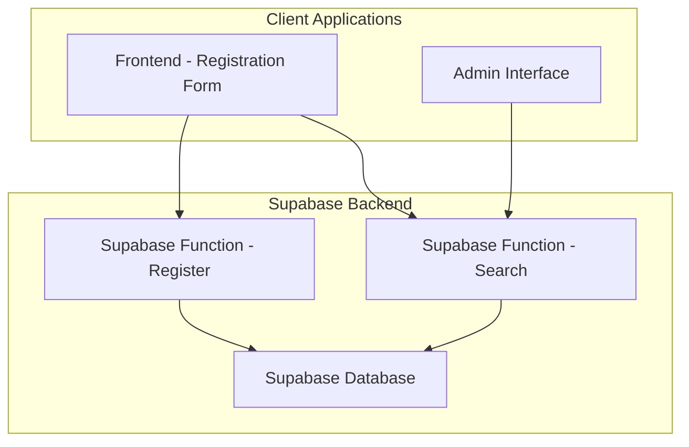

# Design Document

## Overview

การออกแบบระบบลงทะเบียนวัคซีนที่ใช้ Supabase เป็น backend หลัก โดยแทนที่ webhook เดิมด้วย Supabase Functions และเพิ่มฟีเจอร์การค้นหาข้อมูลผู้ป่วย ระบบจะประกอบด้วย 3 ส่วนหลัก: Frontend (HTML/JS), Supabase Functions, และ Supabase Database

## Architecture



### System Components

1. **Frontend Registration Form** - เดิมที่มีอยู่แล้ว แต่จะปรับให้เรียก Supabase Functions
2. **Supabase Functions** - Edge Functions สำหรับ business logic
3. **Supabase Database** - PostgreSQL database สำหรับเก็บข้อมูล
4. **Admin Search Interface** - หน้าใหม่สำหรับค้นหาข้อมูลผู้ป่วย

## Components and Interfaces

### 1. Database Schema

**Table: patient_registrations**
```sql
CREATE TABLE patient_registrations (
  id UUID DEFAULT gen_random_uuid() PRIMARY KEY,
  patient_name TEXT NOT NULL,
  phone_number TEXT NOT NULL,
  line_user_id TEXT,
  created_at TIMESTAMP WITH TIME ZONE DEFAULT NOW(),
  updated_at TIMESTAMP WITH TIME ZONE DEFAULT NOW(),
  
  -- Constraints
  CONSTRAINT unique_phone UNIQUE (phone_number),
  CONSTRAINT unique_line_id UNIQUE (line_user_id) WHERE line_user_id IS NOT NULL,
  CONSTRAINT valid_phone CHECK (phone_number ~ '^0[689][0-9]{8}$')
);

-- Indexes for performance
CREATE INDEX idx_patient_name ON patient_registrations USING gin(to_tsvector('thai', patient_name));
CREATE INDEX idx_line_user_id ON patient_registrations (line_user_id);
CREATE INDEX idx_phone_number ON patient_registrations (phone_number);
CREATE INDEX idx_created_at ON patient_registrations (created_at);
```

### 2. Supabase Functions

**Function 1: register-patient**
- **Endpoint:** `/functions/v1/register-patient`
- **Method:** POST
- **Purpose:** รับข้อมูลการลงทะเบียนและบันทึกลงฐานข้อมูล

**Request Body:**
```typescript
interface RegisterRequest {
  patientName: string;
  phoneNumber: string;
  lineUserId?: string;
}
```

**Response:**
```typescript
interface RegisterResponse {
  success: boolean;
  message: string;
  data?: {
    id: string;
    isUpdate: boolean;
  };
  error?: string;
}
```

**Function 2: search-patient**
- **Endpoint:** `/functions/v1/search-patient`
- **Method:** GET
- **Purpose:** ค้นหาข้อมูลผู้ป่วยด้วย LINE ID หรือชื่อ

**Query Parameters:**
```typescript
interface SearchParams {
  lineId?: string;
  name?: string;
  limit?: number;
}
```

**Response:**
```typescript
interface SearchResponse {
  success: boolean;
  data: Array<{
    id: string;
    patient_name: string;
    phone_number: string;
    line_user_id: string | null;
    created_at: string;
    updated_at: string;
  }>;
  total: number;
}
```

### 3. Frontend Updates

**Modified Registration Form (index.html)**
- เปลี่ยน ENDPOINT จาก webhook เป็น Supabase Function
- เพิ่ม Supabase client configuration
- ปรับ error handling สำหรับ Supabase responses

**New Admin Search Interface (admin.html)**
- ฟอร์มค้นหาด้วย LINE ID หรือชื่อ
- ตารางแสดงผลลัพธ์การค้นหา
- Pagination สำหรับผลลัพธ์จำนวนมาก

## Data Models

### Patient Registration Model
```typescript
interface PatientRegistration {
  id: string;
  patient_name: string;
  phone_number: string;
  line_user_id: string | null;
  created_at: string;
  updated_at: string;
}
```

### Validation Rules
- **patient_name:** ต้องไม่ว่าง, ความยาว 2-100 ตัวอักษร
- **phone_number:** รูปแบบมือถือไทย (0[689]XXXXXXXX)
- **line_user_id:** Optional, unique ถ้ามีค่า

## Error Handling

### Database Errors
- **Duplicate phone number:** Return update existing record
- **Duplicate LINE ID:** Return update existing record  
- **Invalid phone format:** Return validation error
- **Database connection error:** Return service unavailable

### Function Errors
- **Missing required fields:** Return 400 Bad Request
- **Invalid input format:** Return 400 Bad Request
- **Database error:** Return 500 Internal Server Error
- **Rate limit exceeded:** Return 429 Too Many Requests

### Frontend Error Handling
- **Network errors:** Show retry option
- **Validation errors:** Show field-specific messages
- **Server errors:** Show generic error message
- **Success responses:** Show appropriate success message

## Testing Strategy

### Unit Tests
- **Database operations:** Test CRUD operations
- **Validation functions:** Test input validation
- **Phone number formatting:** Test normalization logic
- **Search functionality:** Test query performance

### Integration Tests
- **Function endpoints:** Test complete request/response cycle
- **Database constraints:** Test unique constraints and validation
- **Error scenarios:** Test various error conditions
- **Performance:** Test response times under load

### End-to-End Tests
- **Registration flow:** Test complete user registration
- **Search functionality:** Test admin search interface
- **Error handling:** Test user experience during errors
- **Cross-browser compatibility:** Test on different browsers

## Security Considerations

### Authentication
- Use Supabase API keys for function authentication
- Implement rate limiting on functions
- Validate all input data server-side

### Data Protection
- Store only necessary patient information
- Use HTTPS for all communications
- Implement proper error messages that don't expose sensitive data
- Follow GDPR/PDPA guidelines for data handling

### Access Control
- Separate read/write permissions
- Admin interface requires additional authentication
- Log all data access for audit purposes

## Performance Optimization

### Database Performance
- Use appropriate indexes for search queries
- Implement connection pooling
- Use prepared statements for queries
- Monitor query performance

### Function Performance
- Minimize cold start times
- Use efficient data structures
- Implement caching where appropriate
- Monitor function execution times

### Frontend Performance
- Minimize API calls
- Implement client-side caching
- Use debouncing for search inputs
- Optimize bundle size

## Deployment Strategy

### Environment Setup
1. **Development:** Local Supabase instance
2. **Staging:** Supabase staging project
3. **Production:** Supabase production project

### Migration Plan
1. Create database schema in Supabase
2. Deploy Supabase Functions
3. Update frontend configuration
4. Test integration thoroughly
5. Switch DNS/routing to new system
6. Monitor and rollback if needed

### Monitoring
- Function execution metrics
- Database performance metrics
- Error rates and types
- User registration success rates